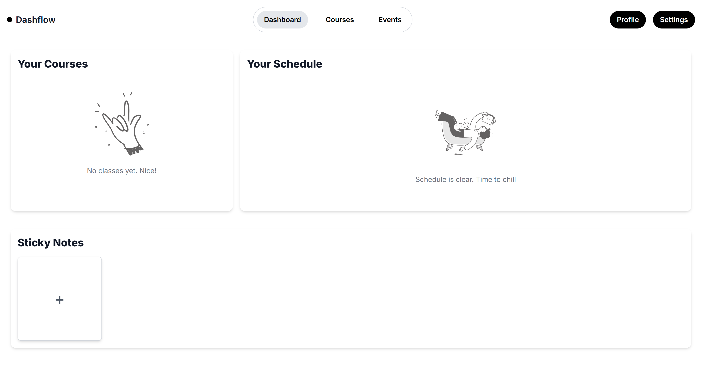

 # Dashflow

Dashflow is a modern web application designed to help students organize their academic life with ease. It offers a streamlined dashboard that enables users to manage their courses, track assignments and deadlines, and visualize their semester through an interactive calendar. The application also includes a flexible sticky notes feature for jotting down quick thoughts or reminders.

## Features

### Dashboard and Schedule

The dashboard provides a clear overview of all active courses and their associated colors. It includes a monthly calendar view that displays all upcoming events, offering users a visual representation of their academic workload. The layout is designed to make it easy to navigate between months and keep track of due dates at a glance.

| Empty Dashboard | Full Dashboard |
|---------|----------------|
 | 

### Course Management

Dashflow allows users to manage their courses efficiently. Each course can be associated with a specific semester (Fall, Winter, or Summer) and year. Users can assign a custom color to each course, making it easier to visually identify them across the dashboard and calendar. Courses can be added, edited, or removed as needed.

| Courses | Add New Course |
|---------|----------------|
|  |  |

### Event Management

Users can create events related to their academic schedule, such as assignments, quizzes, and exams. Events include the following attributes:

- Name  
- Deadline  
- Optional time  
- Weight (e.g., percentage of final grade)  
- Description  
- Optional start date  

Events are linked to their respective courses and visually represented using the course's assigned color.

| Events | Add New Event |
|---------|----------------|
 |  

### Sticky Notes

In addition to structured course and event tracking, Dashflow features a sticky notes tool for flexible note-taking. Users can create and move sticky notes around the screen and assign different background colors to them. This feature is ideal for reminders, to-do lists, or quick ideas that do not fit into specific courses or events.

## Purpose

Dashflow was built to address the need for a student-centric organizational tool that is both simple and effective. Unlike traditional academic portals, Dashflow focuses on usability, customization, and visual clarity, allowing students to manage their semester on their own terms.
